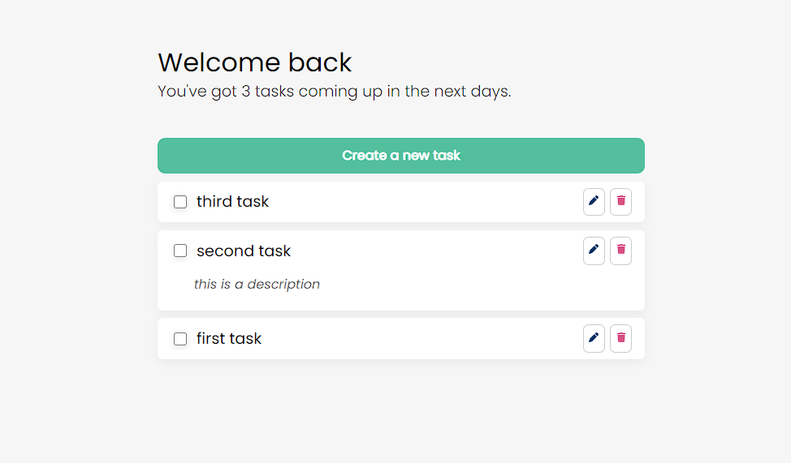

# Nextjs template

## :beginner: Overview

[View demo](https://davitjabushanuri.github.io/nextjs-template/)

## :camera:



## :zap: Usage

### :notebook: Pre-Requisites

To get a local copy up and running follow these simple example steps.

- [git](https://git-scm.com/)
- [NodeJS](https://nodejs.dev/)
- [npm](https://npmjscom/)

### :electric_plug: Installation

After you've made sure to have all the tools installed, you should be able to just run a few commands to get set up

```
git clone git@github.com:davitJabushanuri/advice-generator.git
cd advice-generator
yarn install
yarn start
```

### :hammer: Built With

- [NEXTJS](https://nextjs.org/)

### :house: Development

## :star2: Acknowledgment

### 📝 License

This project is [MIT](https://github.com/davitJabushanuri/readme/blob/master/LICENSE) licensed.
